# Overview
## Project Plan
* A link to a spreadsheet that includes the original and final project plan>
[Spreadsheet link](https://docs.google.com/spreadsheets/d/1r-QCQrMUD3tgQreZDlkejPOZut9TXzJQElnBdDQvl2I/edit?usp=sharing)

* A link to Trello Board>
[Trello link](https://trello.com/b/7zYl4UN0/devops2-agile-sprint-board)

## Instructions
* Create a Github repo
* Lauch Azure Shell env.
* Clone the repo to Azure
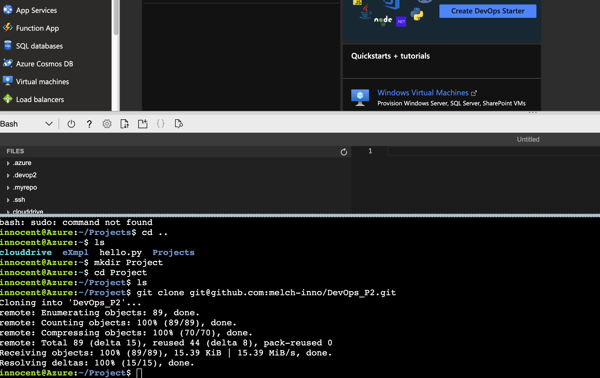


* Create Makefile
* Create requirement.txt
* Create a Python virtual environment

* Enable Github action UI
* Replace yml file with scaffolding 
* Verify remote tests pass in Github Actions UI

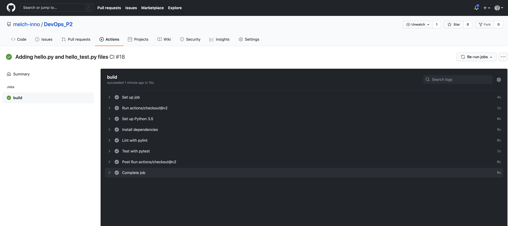


* Project running on Azure App Service

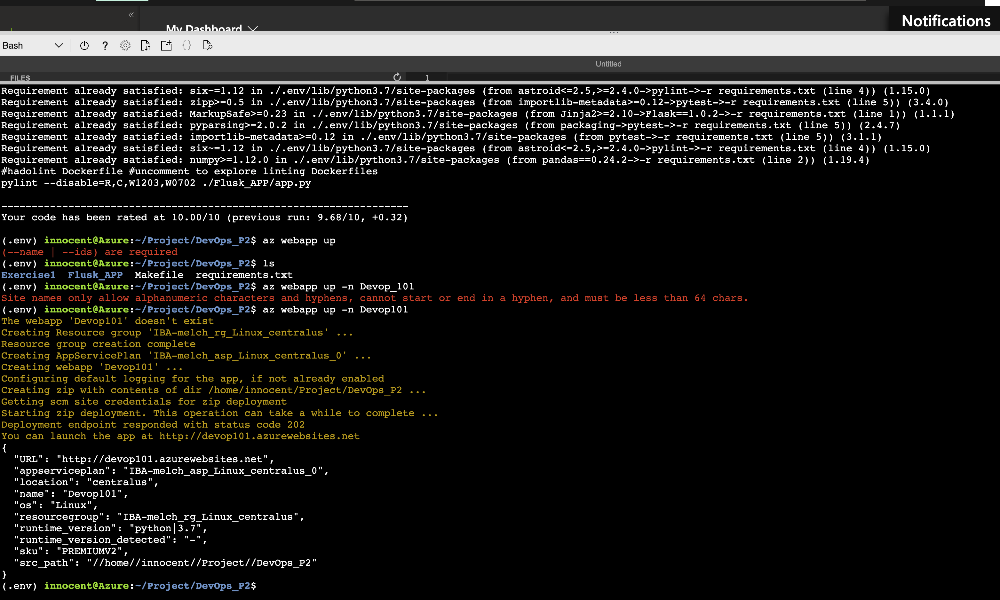

* Project cloned into Azure Cloud Shell
    ```git clone git@github.com:melch-inno/DevOps_P2.git```


* Passing tests that are displayed after running the `make all` command from the `Makefile`

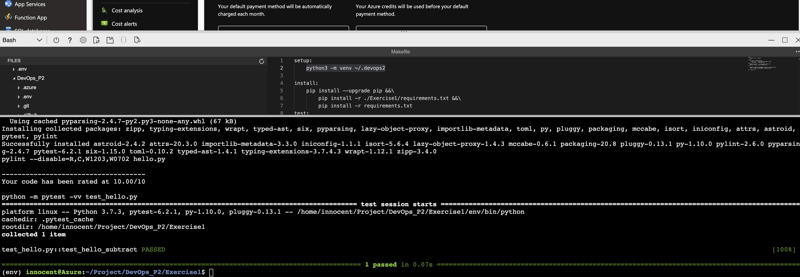

* Output of a test run

* Successful deploy of the project in Azure Pipelines.  [Note the official documentation should be referred to and double checked as you setup CI/CD](https://docs.microsoft.com/en-us/azure/devops/pipelines/ecosystems/python-webapp?view=azure-devops).

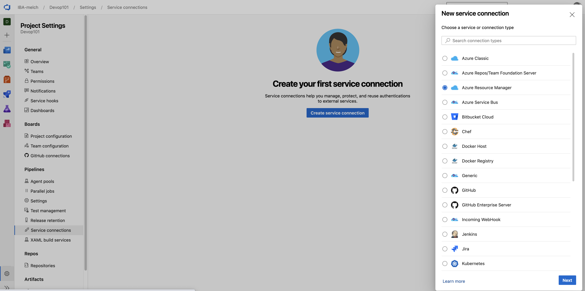 \n

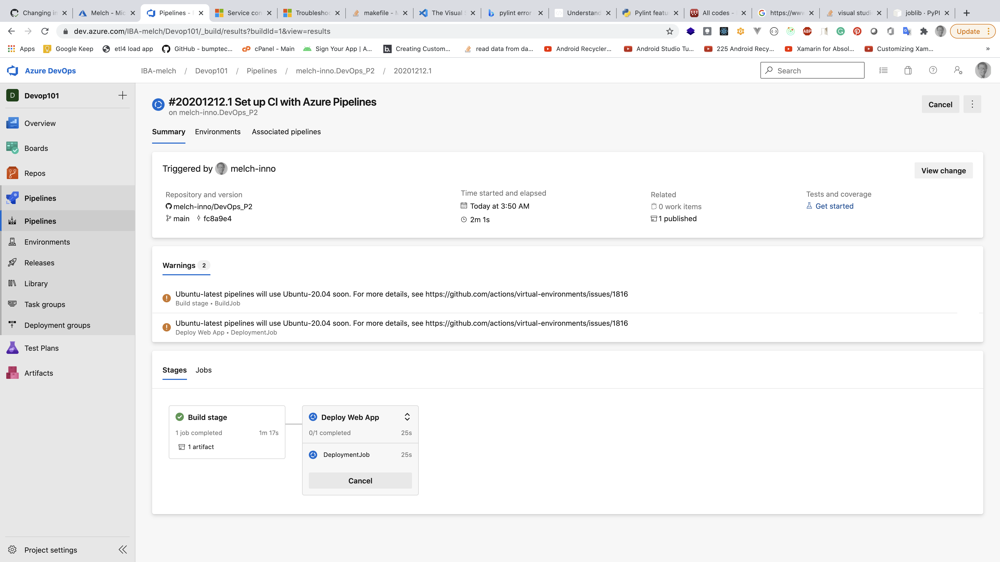

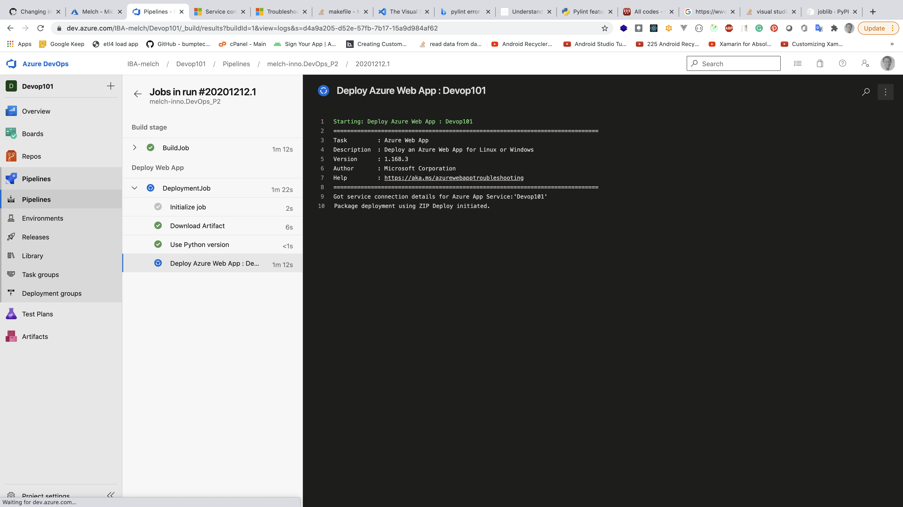

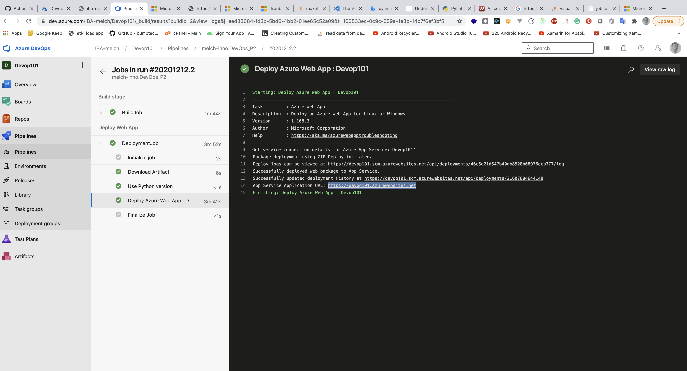


* Running Azure App Service from Azure Pipelines automatic deployment

* Successful prediction from deployed flask app in Azure Cloud Shell.  [Use this file as a template for the deployed prediction](https://github.com/udacity/nd082-Azure-Cloud-DevOps-Starter-Code/blob/master/C2-AgileDevelopmentwithAzure/project/starter_files/flask-sklearn/make_predict_azure_app.sh).
The output should look similar to this:

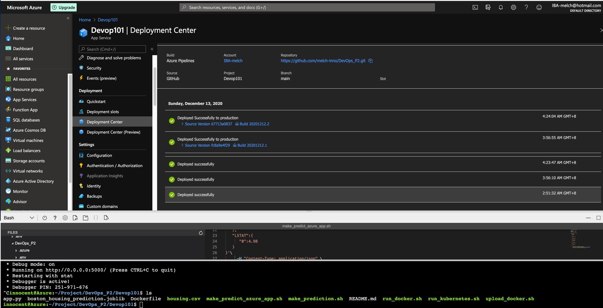


```bash
innocent@Azure:~$ ./make_predict_azure_app.sh
Port: 443
{"prediction":[20.35373177134412]}
```

* Output of streamed log files from deployed application
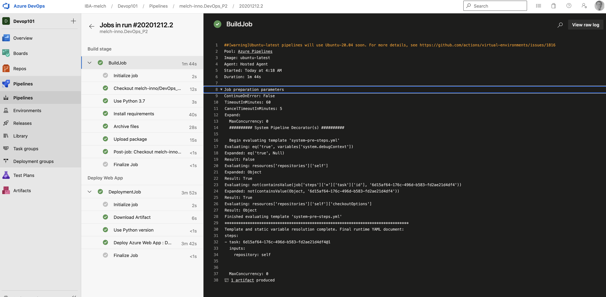
> 


* Include a locustfile.py
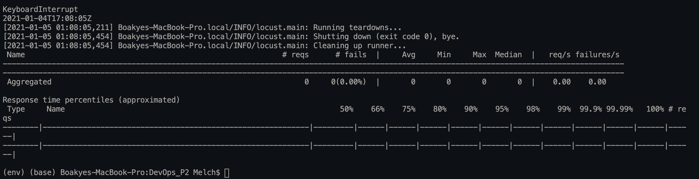

## Enhancements

<TODO: Future Improvements>
* Build a full functional Python API of Language processing for prediction
* Deploy to Azure using Azure Pipeline

## Demo 

<TODO: Add link Screencast on YouTube>


